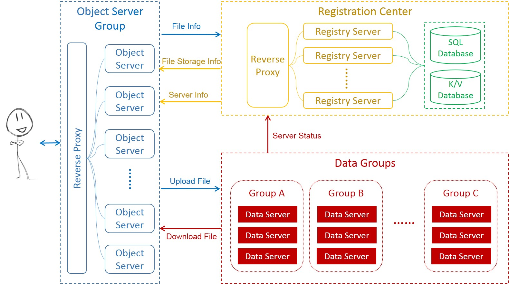

# Arkor - Object Storage Service

## Introduction 

Arkor is an object storage service application with high availability and high performance. It is best suited for storing blobs such as container/VM images, software packages, log files, videos, photos and so on. As a distributed system, Arkor can be easily scaled out by simply adding more servers horizontally or embeded into other application developed by Golang. 

## Features

* Compatible with [Git-LFS (Git Large File Storage)](https://git-lfs.github.com/)
* High Performance
	* Efficient data storage server written in C language
	* Split large file into small pieces and upload/download concurrently
	* Object server upload/download file directly to/from data server
* High Availability&Scalability
	* Stateless Object&Registry server
	* 3 replications data storage 
	* Dynamic scaled out

## Quick Start
### Prerequisites
 Before you use Arkor, please make sure `golang`, `mysql` and `redis` are installed in your machine. And if you run the **`allinone` mode**, please make sure there are more than **6GB free space** in your machine and **Port `8125`,`8126`,`8127` is NOT Occupied**

### Try it out in `allinone` mode

* **complie and run**
```bash
cd github.com/containerops
git clone https://github.com/containerops/arkor
cd arkor
make
./arkor allinone
```

* **Upload an object**

```bash
curl -X PUT -H "Content-Length: SIZE_OF_OBJECT_TO UPLOAD" -d 'OBJECT_CONTENT' "http://ARKOR_ADDRESS:ARKOR_PORT/v1/BUCKET_NAME/OBJECT_NAME"
```
e.g  (For now, `BUCKET_NAME` can be any string you like )
```bash
curl -X PUT -H "Content-Length:13"  -d 'testcontent1' "http://10.229.40.140:8990/v1/testbucket/test1"
```


* **Download an object**
```bash
curl -X GET "http://ARKOR_ADDRESS:ARKOR_PORT/v1/BUCKET_NAME/OBJECT_NAME"
```
e.g  (For now, `BUCKET_NAME` can be any string you like )

```bash
curl -X GET "http://10.229.40.140:8990/v1/testbucket/test1"
```


#### arkor runtime configuration
Please add a runtime config file named runtime.yaml under arkor/conf before starting arkor service. Below is a runtime.yaml example:

``` yaml
run:
  runMode: dev         # application run mode,must be `dev` or `prod`
  logPath: log/arkor   # where arkor logs are stored
http:
  listenMode: http     # support http and https protocol 
  httpsCertFile: cert/containerops/containerops.crt   # specify user own https certificate file by this parameter.
  httpsKeyFile: cert/containerops/containerops.key    # specify user own https key file by this parameter.
sqldatabase:
  driver: mysql      
  username: root    # specify the user to login and access the SQL database
  password: wang    # specify the password of the user
  protocol: tcp     # the protocol of connection to the database
  host: 127.0.0.1   # host address of SQL database
  port: 3306        # listen port of SQL database
  schema: arkor     # the database name of arkor used
kvdatabase:
  driver: redis              
  username: root               # specify the user to login and access the K/V database
  password: containerops       # specify the password of the user
  protocol: tcp                # the protocol of connection to the database
  host: 127.0.0.1              # host address of K/V database
  port: 6379                   # listen port of K/V database
  partition: 0                 # specify db partition number

```

## Architecture

Arkor include three modules: Object Server Group, Registration Center and Data Groups:



### Object Server Group

`Object Server Group` is a statelless proxy server group that designed to provide REST API for user to PUT/GET files and manage the file/metadata. When a user wants to PUT/GET a file, it retrives data server info and file storage info(e.g fileID) from  `Registry Center` and execute the PUT/GET operations directly with related `Data Server`.

### Registry Center

`Registry Center` maintains the server and file information. It has three main functions: 
  - recive, store and send the basic information and status of all `Data Servers`. 
	- recive, store and send the metadata of files storaged in arkor. 
	- allocate fileID to `Object Server Group` when user wants to upload files.

### Data Group

`Data Group` contains multiple (usually three) highly optimized storage engine for performance and space efficiency called `Data Server`. It appends single small file to large file to keep the IO overhead at a low level. When user starts a PUT process, the `Object Server Group` will PUT the file to all `Data Servers` in the group. But in the GET process, the `Object Server Group` retrive file from any of it.  

## Developers Guide

See the document of [APIs](docs/specs/API.md), [FileID spec](docs/specs/FileID.md), [Internal APIs](docs/specs/Internal.md)

## License
The code is licensed under the MIT licence


